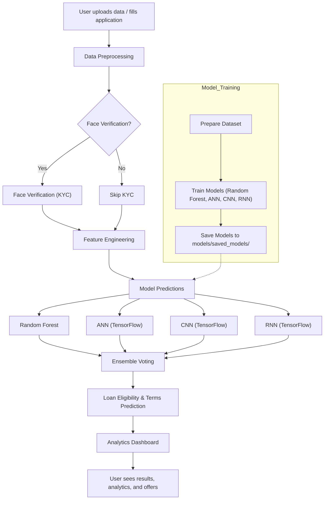

# 🏦 AI-Powered Loan Origination System

A comprehensive loan origination system that leverages multiple AI models (CNN, ANN, RNN, Random Forest) and association mining for dynamic loan prediction, customer persona analysis, and personalized loan packages.

## 🚀 Features

### 🤖 AI Models
- **Artificial Neural Network (ANN)**: Primary loan eligibility prediction
- **Convolutional Neural Network (CNN)**: Feature extraction and pattern recognition
- **Recurrent Neural Network (RNN)**: Dynamic loan terms prediction
- **Random Forest**: Ensemble learning for robust predictions
- **K-Means Clustering**: Customer segmentation and persona creation

### 🔍 Advanced Analytics
- **Face Verification**: KYC using face recognition technology
- **Association Mining**: Finding relatable customers from dataset
- **Dynamic Loan Packages**: Personalized offers based on customer profile
- **Real-time Analytics**: Comprehensive dashboard with model performance metrics
- **Customer Personas**: Clustering-based customer segmentation

### 📊 Interactive Dashboard
- **Model Performance Metrics**: Accuracy, precision, recall, F1-score
- **Customer Distribution**: Visual representation of customer segments
- **Training Progress**: Model training visualization
- **Feature Importance**: Understanding key decision factors
- **Approval Analytics**: Loan approval patterns and trends

## 📋 Prerequisites

- **Python**: 3.8 or higher
- **Memory**: Minimum 4GB RAM (8GB recommended)
- **Storage**: 2GB free space for models and data
- **OS**: Windows, macOS, or Linux

## 🛠️ Installation

### 1. Clone the Repository
```bash
git clone <repository-url>
cd loan_origination_system
```

### 2. Install Dependencies

#### For All Platforms:
```bash
pip install -r requirements.txt
```

#### For macOS (if you encounter issues):
```bash
pip install -r requirements-mac.txt
```

#### TensorFlow Installation (Required for Deep Learning Models)

**For most users (Windows/Linux/Intel Mac):**
```bash
pip install tensorflow
```

**For Apple Silicon (M1/M2/M3 Macs):**
```bash
pip install tensorflow-macos==2.16.2
pip install tensorflow-metal==1.2.0
```

**Alternative installation (if version-specific fails):**
```bash
pip install tensorflow-macos
pip install tensorflow-metal
```

> **Note**: TensorFlow is required for the deep learning models (ANN, CNN, RNN). If you encounter issues on Apple Silicon, see the [official Apple guide](https://developer.apple.com/metal/tensorflow-plugin/).

### 3. Setup Project Structure
```bash
python setup.py
```

This will:
- Create necessary directories
- Set up Python packages
- Check for dataset
- Install dependencies
- Configure face database

## 📁 Project Structure

```
loan_origination_system/
├── app.py                          # Main Flask application
├── config.py                       # Configuration settings
├── setup.py                        # Project setup script
├── requirements.txt                # Python dependencies
├── requirements-mac.txt            # macOS-specific dependencies
├── README.md                       # This file
│
├── data/                           # Data directory
│   ├── Insurance_Enhanced.csv     # Main dataset (required)
│   └── face_database/             # Face images for KYC
│       ├── README.txt
│       └── sample_user.jpg
│
├── models/                         # AI Models
│   ├── __init__.py
│   ├── train_models.py            # Advanced model training
│   ├── loan_predictor.py          # Main prediction logic
│   ├── face_verification.py       # Face recognition
│   └── saved_models/              # Trained model files
│       ├── ann_model.h5
│       ├── cnn_model.h5
│       ├── rnn_model.h5
│       ├── rf_model.pkl
│       ├── kmeans_model.pkl
│       ├── scaler.pkl
│       └── label_encoders.pkl
│
├── utils/                          # Utilities
│   ├── __init__.py
│   └── data_preprocessing.py      # Data preprocessing
│
├── static/                         # Web assets
│   ├── css/
│   │   └── style.css
│   ├── js/
│   │   └── main.js
│   ├── plots/                      # Generated visualizations
│   └── uploads/                    # File uploads
│
└── templates/                      # HTML templates
    ├── index.html                  # Main application page
    └── result.html                 # Results page
```

## 🎯 Quick Start

### 1. Prepare Your Dataset
Place your `Insurance_Enhanced.csv` file in the `data/` directory. The dataset should contain:
- Customer demographic information
- Financial data
- Loan history (if available)
- Target variable (loan approval status)

### 2. Train the Models
Choose one of the following training options:

#### Option A: Stable Training (Recommended)
```bash
python train_dynamic_stable.py
```

#### Option B: Advanced Training with Visualizations
```bash
python models/train_models.py
```

#### Option C: Simple Training
```bash
python simple_train.py
```

### 3. Run the Application
```bash
python app.py
```

The application will automatically:
- Check if models exist and train them if needed
- Start the Flask server on `http://localhost:5000`
- Open the loan origination system interface

### 4. Access the System
Open your browser and navigate to `http://localhost:5000`

## 🔧 Configuration

### Key Settings (config.py)

```python
# Loan approval threshold (0.10 = 10% threshold for easier approval)
LOAN_ELIGIBILITY_THRESHOLD = 0.10

# Face verification tolerance (lower = more strict)
FACE_TOLERANCE = 0.6

# Maximum file upload size
MAX_CONTENT_LENGTH = 16 * 1024 * 1024  # 16MB
```

### Model Parameters

The system uses multiple AI models with the following configurations:

- **ANN**: 3-layer neural network with dropout and batch normalization
- **CNN**: 1D convolutional network for feature extraction
- **RNN**: LSTM-based network for sequential pattern recognition
- **Random Forest**: 100 trees with optimized hyperparameters
- **K-Means**: 5 clusters for customer segmentation

## 🔄 Project Flow

### How the System Works



**Key Components:**
- **Data Preprocessing**: Handles missing values, encoding, scaling
- **Face Verification**: Optional KYC using face recognition
- **Feature Engineering**: Creates 29+ features from 17 original columns
- **Model Predictions**: Ensemble of 4 models (RF + 3 TensorFlow models)
- **Ensemble Voting**: Weighted average for final prediction
- **Analytics Dashboard**: Real-time model performance and insights

## 📊 Usage Guide

### 1. Loan Application Process

1. **Fill Application Form**: Enter customer information
2. **Face Verification**: Upload photo for KYC (optional)
3. **AI Prediction**: System uses multiple models for prediction
4. **Results Display**: View eligibility, loan terms, and offers
5. **Analytics**: Access comprehensive analytics dashboard

### 2. Analytics Dashboard

The system provides a comprehensive analytics dashboard with:

- **Model Performance**: Accuracy, precision, recall metrics
- **Customer Segments**: Visual representation of customer clusters
- **Feature Importance**: Key factors influencing decisions
- **Training Progress**: Model training visualization
- **Approval Patterns**: Loan approval trends and analysis

### 3. Face Verification

To use face verification:
1. Add face images to `data/face_database/`
2. Use supported formats: `.jpg`, `.jpeg`, `.png`
3. Name files consistently (e.g., `user_001.jpg`)
4. The system will automatically match uploaded photos

## 🧪 Testing

### Test Scripts Available

```bash
# Test loan approval system
python test_approval.py

# Test dynamic system features
python test_dynamic_system.py
```

### Manual Testing

1. **Basic Functionality**: Submit loan applications with various profiles
2. **Edge Cases**: Test with missing data, extreme values
3. **Face Verification**: Test with different face images
4. **Analytics**: Verify dashboard functionality

## 🔍 Troubleshooting

### Common Issues and Solutions

#### 1. TensorFlow Installation Issues

**If TensorFlow is not installed:**
```bash
# For most users
pip install tensorflow

# For Apple Silicon Macs
pip install tensorflow-macos==2.16.2
pip install tensorflow-metal==1.2.0

# Alternative (if version-specific fails)
pip install tensorflow-macos
pip install tensorflow-metal
```

**If you encounter memory issues:**
```bash
# The system automatically configures TensorFlow for CPU mode
# If you encounter memory issues, try:
export TF_CPP_MIN_LOG_LEVEL=2
export TF_ENABLE_ONEDNN_OPTS=0
```

**Verify TensorFlow installation:**
```bash
python -c "import tensorflow as tf; print(f'TensorFlow version: {tf.__version__}')"
```

#### 2. Missing Dependencies
```bash
# Upgrade pip first
pip install --upgrade pip

# Install dependencies
pip install -r requirements.txt

# For macOS users
pip install -r requirements-mac.txt
```

#### 3. Dataset Issues
- Ensure `Insurance_Enhanced.csv` is in the `data/` directory
- Check file format and encoding
- Verify required columns are present

#### 4. Model Training Fails
```bash
# Try stable training
python train_dynamic_stable.py

# Or use simple training
python simple_train.py

# Check available memory
free -h  # Linux
top -l 1 | grep PhysMem  # macOS
```

#### 5. Face Verification Issues
- Ensure face images are in `data/face_database/`
- Use clear, well-lit photos
- Check file formats (jpg, jpeg, png)
- Verify image quality and size

### Error Messages

| Error | Solution |
|-------|----------|
| `ModuleNotFoundError` | Run `pip install -r requirements.txt` |
| `FileNotFoundError: Insurance_Enhanced.csv` | Place dataset in `data/` directory |
| `MemoryError` | Close other applications, use `train_dynamic_stable.py` |
| `Face verification failed` | Check face database and image quality |

## 📈 Performance Optimization

### For Large Datasets
- Use `train_dynamic_stable.py` for memory-efficient training
- Consider reducing model complexity in `config.py`
- Use batch processing for large datasets

### For Production Deployment
- Set `LOAN_ELIGIBILITY_THRESHOLD` to appropriate value
- Configure proper secret keys
- Use production-grade web server (Gunicorn, uWSGI)
- Implement proper logging and monitoring

## 🤝 Contributing

1. Fork the repository
2. Create a feature branch (`git checkout -b feature/amazing-feature`)
3. Commit your changes (`git commit -m 'Add amazing feature'`)
4. Push to the branch (`git push origin feature/amazing-feature`)
5. Open a Pull Request

## 📝 License

This project is licensed under the MIT License - see the LICENSE file for details.

## 🙏 Acknowledgments

- TensorFlow team for deep learning capabilities
- Scikit-learn for machine learning algorithms
- Flask for web framework
- Face recognition library for KYC functionality
- OpenCV for image processing

## 📞 Support

For support and questions:
- Check the troubleshooting section above
- Review the documentation files in the project
- Open an issue on the repository

## 🔄 Version History

- **v1.0**: Initial release with basic loan prediction
- **v1.1**: Added face verification and customer personas
- **v1.2**: Implemented dynamic loan packages and analytics
- **v1.3**: Enhanced with association mining and comprehensive dashboard

---

**Note**: This system is designed for educational and demonstration purposes. For production use, ensure proper security measures, data privacy compliance, and thorough testing. 